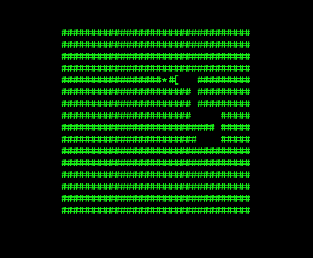
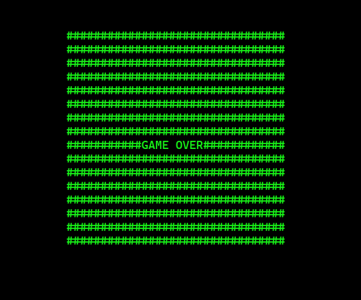

# Snake Game in C

## How to Compile & Run

```bash
gcc snake.c -o snake
./snake
```

## How to Play

Use `W`, `A`, `S` and `D` to move the snake

Use `q` to quit the game

## Gameplay

`*`: Food

`#`: Grass

`]`, `[`, `-`, `_`: Snake head. Changes according to direction

## Screenshots

<p align="center">
    
</p>

<p align="center">
    
</p>
